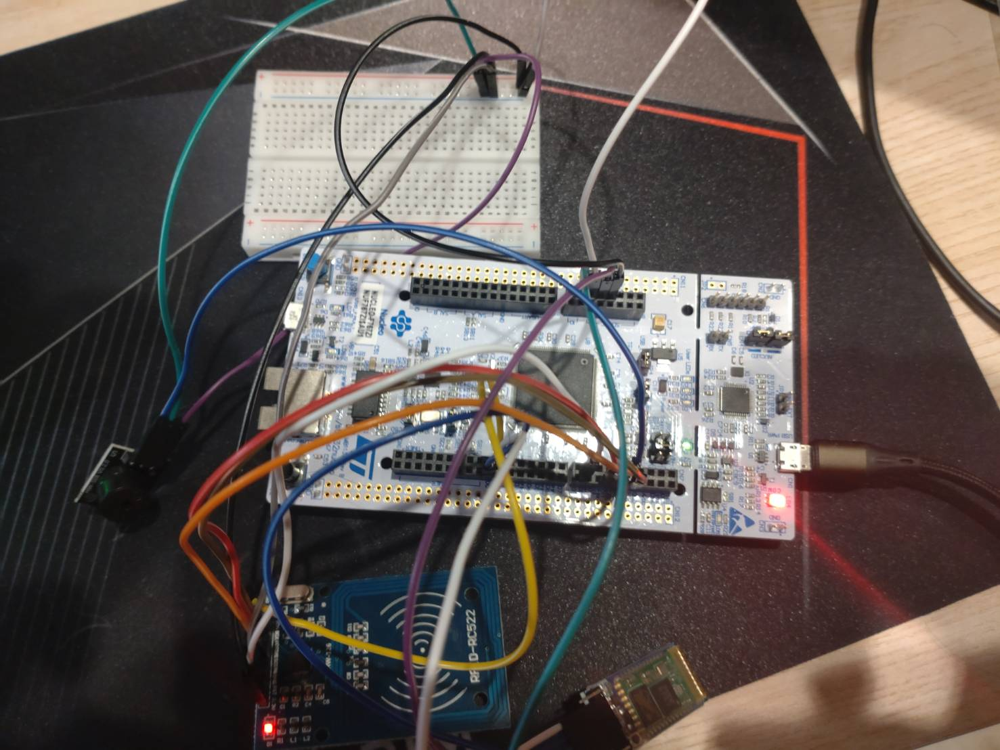

# RollCall_RC522

This project implements a **wireless, standalone roll-call terminal** intended for classroom use. An STM32 microcontroller reads the unique identifier (UID) of an RFID/NFC card, a buzzer provides audible feedback, and an HC-05 Bluetooth module transmits the card identifier wirelessly to a host computer. A Python script running on the host writes each received record into a SQLite database in real time.

```
[Student taps card] → [RC522] → [STM32F767ZI] → [Buzzer feedback]
                                       │ (USART6 / HC-05 Bluetooth)
                                       ▼
                         [Bluetooth virtual serial port] → [Python host] → [SQLite database]
```



---

## Directory Structure

```
RollCall_RC522/
├── Core/                  # Main application and HAL configuration generated by STM32CubeMX (main.c, etc.)
├── Drivers/               # STM32 HAL / CMSIS libraries
├── Modules/RC522/         # RC522 RFID driver (rc522.c / rc522.h)
├── Vendors/               # Third-party / vendor-supplied source code
├── cmake/                 # CMake toolchain file and CubeMX-generated subproject
├── Host/                  # Host-side Python listener and database writer (rollcall_host)
├── RollCall_RC522.ioc     # STM32CubeMX project configuration
├── CMakeLists.txt / CMakePresets.json
└── startup_stm32f767xx.s / STM32F767xx_FLASH.ld
```

---

## Development Environment

This project is developed and built under the **MSYS2 MINGW64** shell. The following tool versions have been verified to function correctly on the reference machine, as reported by `pacman -Q`.

| Tool | Version | Source / Package Name |
| :--- | :--- | :--- |
| MSYS2 (uname) | `3.6.3` | — |
| CMake | `4.3.2` | `mingw-w64-x86_64-cmake` |
| Ninja | `1.13.2` | `mingw-w64-x86_64-ninja` |
| GNU Make | `4.4.1` | Included in the MSYS base installation; provided for reference, as this project builds primarily with Ninja |
| arm-none-eabi-gcc | `13.3.0` | `mingw-w64-x86_64-arm-none-eabi-gcc` |
| arm-none-eabi-binutils | `2.46.0` | `mingw-w64-x86_64-arm-none-eabi-binutils` |
| arm-none-eabi-newlib | `4.5.0.20241231` | `mingw-w64-x86_64-arm-none-eabi-newlib` |
| OpenOCD | `0.12.0` | `mingw-w64-x86_64-openocd` |
| Git | `2.50.1` | — |
| Python (MSYS2 MINGW64) | `3.14.5` | `mingw-w64-x86_64-python` |
| ├─ pyserial | `3.5` | `mingw-w64-x86_64-python-pyserial` |
| └─ python-dotenv | `1.2.2` | `mingw-w64-x86_64-python-dotenv` |
| STM32CubeMX | `6.18.1` | See `MxCube.Version` in `RollCall_RC522.ioc` |
| STM32Cube FW_F7 | `V1.17.4` | See `ProjectManager.FirmwarePackage` in `RollCall_RC522.ioc` |
| Target MCU | STM32F767ZIT6 (Cortex-M7) | Nucleo-F767ZI |

⚠️ **Notes:**
- A single, fixed Python interpreter paired with a virtual environment (venv) is recommended to avoid inconsistent serial-port detection.
- No `.venv` has yet been created under `Host/`. The packages listed in `requirements.txt` (`pyserial>=3.5`, `python-dotenv>=1.0`) are compatible with the versions installed globally via MSYS2; however, creating a dedicated virtual environment is still recommended for clean isolation.
- No `st-info` or ST-LINK utility was detected on the reference machine. Flashing or debugging via ST-LINK requires installing STM32CubeProgrammer or the `stlink` toolset separately.
- `clangd` was not detected on the reference machine. `CMakeLists.txt` enables `CMAKE_EXPORT_COMPILE_COMMANDS`; integrating clangd for editor-side indexing requires a separate installation.

---

## Building the Firmware (MCU Firmware)

The firmware is built using CMake Presets together with Ninja and the `arm-none-eabi-gcc` toolchain (see `cmake/gcc-arm-none-eabi.cmake`):

```bash
# Run from the MSYS2 MINGW64 shell
cmake --preset Debug        # or Release
cmake --build --preset Debug
```

The resulting ELF, BIN, and HEX files are placed under `build/Debug/` (or `build/Release/`). Flashing may be performed using OpenOCD or STM32CubeProgrammer.

---

## Host Application

`Host/` contains the Python application that listens on the Bluetooth virtual serial port, parses incoming `CARD:XXXXXXXX` packets, and writes the corresponding records into a SQLite database:

```bash
cd Host
python -m venv .venv
source .venv/bin/activate
python -m pip install -r requirements.txt
cp .env.example .env    # Edit SERIAL_PORT to match the actual serial device
python main.py
```

For Bluetooth pairing, `.env` configuration details, and troubleshooting, follow the procedure above. `.env.example` documents each parameter along with its default value.

---

## License

This project is licensed under the [MIT License](LICENSE).
